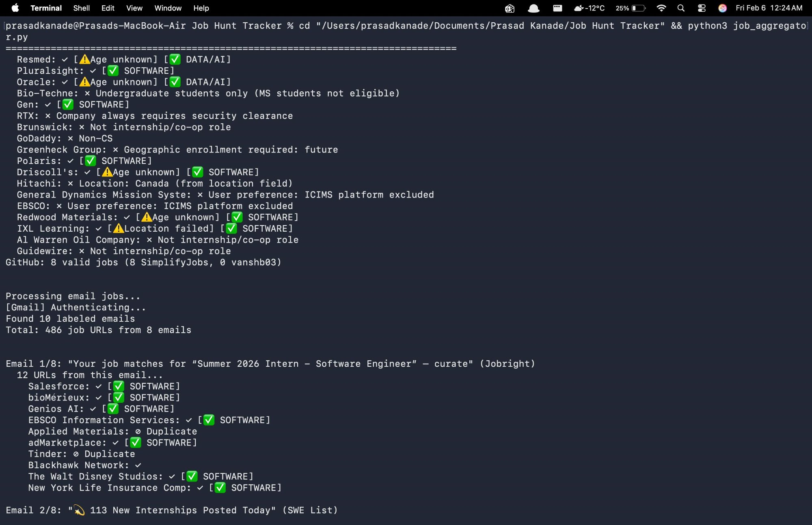
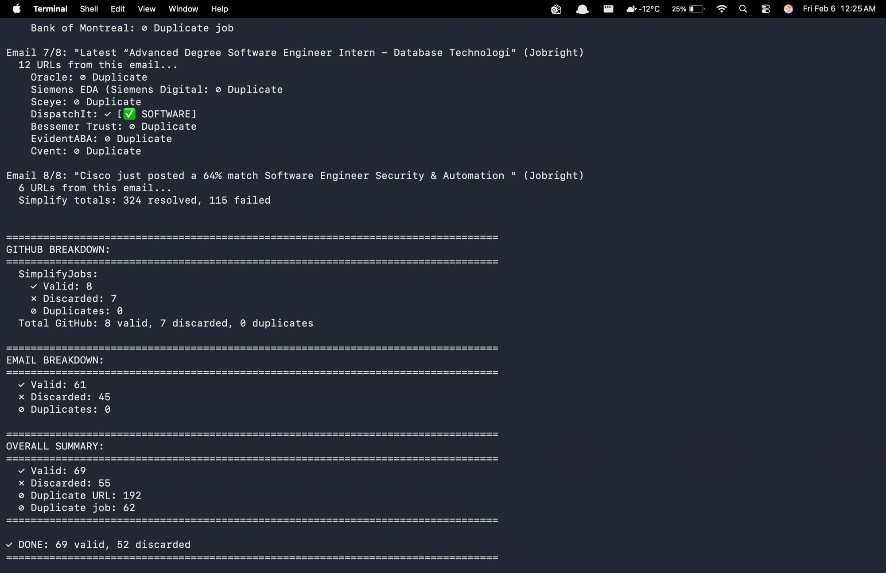
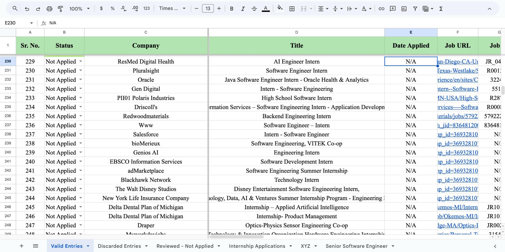
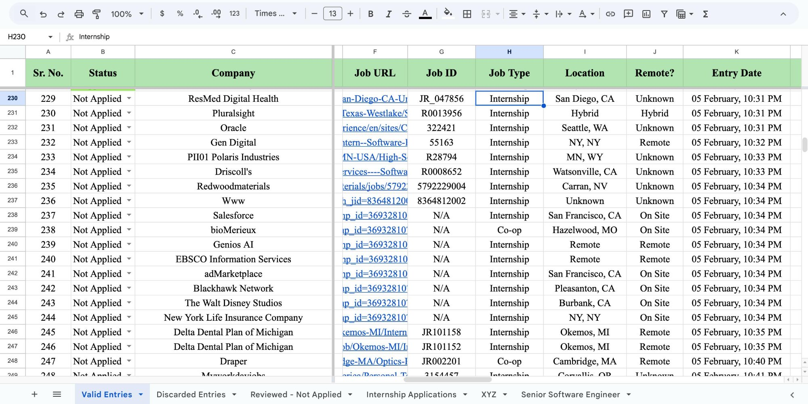

# Automated Job Application Tracker

**Intelligent pipeline for aggregating, validating, and tracking software engineering internship opportunities with 98%+ accuracy.**

Built by [Prasad Kanade](https://linkedin.com/in/prasad-kanade-) | MS Computer Science @ Northeastern University

---

## The Problem

Tracking 600+ internship applications across SimplifyJobs, Jobright, LinkedIn, and email alerts was eating **6 hours every week**. Copy-pasting links, checking for duplicates, filtering out ineligible roles — all manual, all error-prone.

## The Solution

A production-grade Python pipeline that automatically aggregates 2,000+ weekly job postings from GitHub repositories and Gmail, validates against 11 eligibility criteria, and maintains an organized Google Sheets tracker.

**Impact:** 6 hours/week → 45 minutes/week (85% reduction) · Zero duplicate applications · 4x faster processing

---

## Pipeline in Action

### GitHub Scraping & Multi-Source Validation
The pipeline scrapes GitHub repositories (SimplifyJobs, vanshb03) and validates each job through eligibility filters — security clearance, visa requirements, degree level, geographic restrictions, and more.



### Email Processing & Deduplication
Gmail API integration processes job alert emails from Jobright and SWE List, with intelligent duplicate detection across 1,200+ tracked entries.



### Google Sheets Output — Titles & Companies
Validated jobs are automatically pushed to a structured Google Sheets tracker with company names, job titles, application status, and source URLs.



### Google Sheets Output — Location & Metadata
Each entry includes extracted job IDs, job type classification, location, remote status, and timestamps — all extracted automatically.



---

## Key Features

### Multi-Source Aggregation
- GitHub repositories (SimplifyJobs, vanshb03)
- Gmail API integration (Jobright, SWE List alerts)
- Web scraping (Selenium + BeautifulSoup4)

### 11-Stage Validation Pipeline
- Company/platform blacklists
- Security clearance requirements
- Degree requirements (Undergraduate/PhD filtering)
- Geographic enrollment restrictions
- F-1 visa eligibility (CPT/OPT detection)
- US Person/DoD contract requirements
- Graduation year alignment
- Job posting age validation
- Non-CS role filtering
- Location-based filtering (Canada, non-US)
- User preference exclusions (ICIMS platform, etc.)

### Advanced Extraction
- 7-method company extraction (dynamic Workday parsing, JSON-LD, meta tags)
- 7-method location extraction
- 4-method job ID extraction
- 5-method job type detection with tiered validation

### Performance Optimizations
- Selenium driver singleton (4x speedup: 40 min → 10 min)
- Set-based O(1) deduplication (83% memory reduction)
- HTTP response caching
- Lazy loading with mid-run refresh

---

## Technical Highlights

**Tiered Validation:** 90% of jobs validated in <1ms through metadata-first approach. Only edge cases hit expensive regex and context-aware pattern matching.

**Context-Aware Detection:** Degree list parsing prevents false rejections (e.g., "BA, BS, MS, PhD" correctly identified as MS-eligible).

**Smart Deduplication:** Multi-signal matching (URL + Company|Title + Job ID) with O(1) set-based lookups across 1,200+ tracked jobs.

**Dynamic Company Extraction:** Zero hardcoded mappings. Extracts company names from page titles, structured data, and meta tags. Self-learning for Workday sites.

---

## Architecture

```
Data Sources (GitHub, Gmail, Web)
    → SimplifyJobs 4-Method Resolution
    → Multi-Method Extraction (Company, Location, Job ID, Type)
    → 11-Stage Validation Pipeline
    → Multi-Signal Deduplication
    → Google Sheets Output
```

---

## Performance Metrics

| Metric | Before | After |
|--------|--------|-------|
| Processing Time | 40 min | 10 min |
| Weekly Manual Work | 6 hours | 45 min |
| Duplicate Applications | 2-5/run | 0 |
| Classification Accuracy | ~85% | 98%+ |
| Memory Usage | 17KB | 3KB |

---

## Tech Stack

**Core:** Python 3.10+, Google Sheets API, Gmail API
**Web Scraping:** Selenium WebDriver, BeautifulSoup4, Requests
**Processing:** Regex pattern matching, set-based operations, context-aware validation

**Codebase:** 8,000+ lines across 6 production modules

---

## File Structure

| File | Lines | Purpose |
|------|-------|---------|
| `config.py` | 1,342 | Configuration, patterns, constants |
| `processors.py` | 2,092 | Validation & extraction logic |
| `extractors.py` | 1,452 | Page fetching, Selenium handling |
| `run_aggregator.py` | 1,236 | Pipeline orchestration |
| `sheets_manager.py` | 479 | Google Sheets integration |
| `utils.py` | 910 | Sanitization & parsing utilities |

---

## Quick Start

```bash
# Install dependencies
pip install gspread oauth2client beautifulsoup4 selenium requests lxml

# Configure API credentials (Google Sheets + Gmail)
# Edit config.py with your settings

# Run pipeline
python3 job_aggregator.py
```

**Requirements:** Google Sheets API credentials, Gmail API credentials, ChromeDriver

---

## Results

**Sample daily run:** Processes 500+ postings → 69 valid, 52 discarded, 192 duplicate URLs caught, 62 duplicate jobs filtered — all in 10 minutes.

**Cumulative:** 248+ tracked entries across 15+ platforms with zero duplicate applications and accurate F-1 visa eligibility filtering.

---

## Use Cases

- Graduate students tracking hundreds of internship applications
- International students with visa restrictions (F-1, CPT/OPT filtering)
- Job seekers aggregating from multiple sources
- Recruitment analytics and market research

---

## Contact

**Prasad Chandrashekhar Kanade**
MS Computer Science | Northeastern University | May 2027
Seeking Summer 2026 SDE Internships

📧 kanade.pra@northeastern.edu
💼 [LinkedIn](https://linkedin.com/in/prasad-kanade-)
🐙 [GitHub](https://github.com/prasad0411)

---