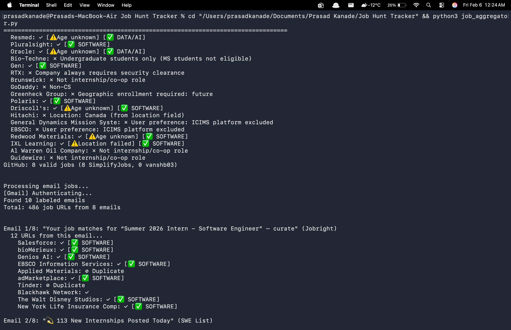
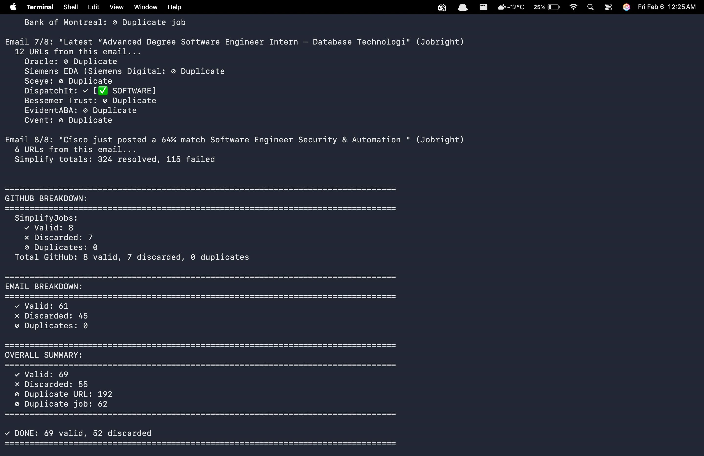
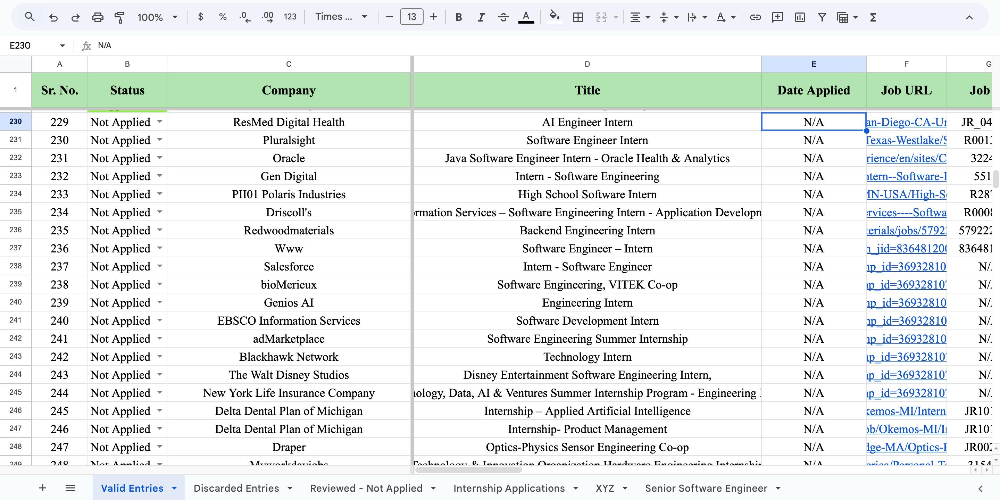
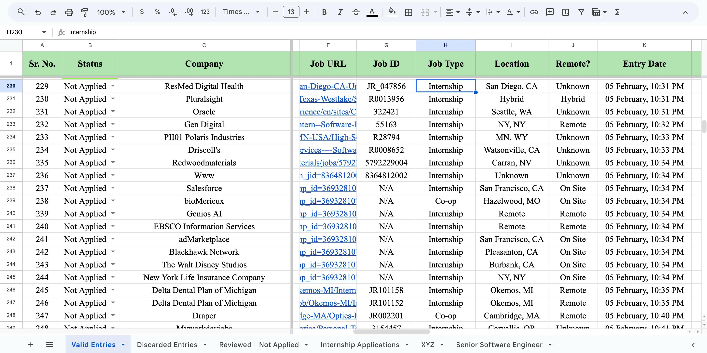
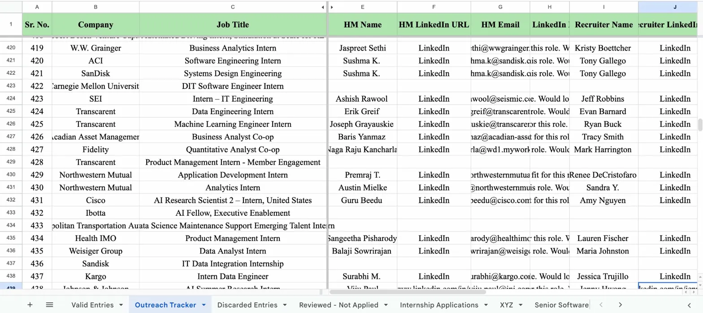
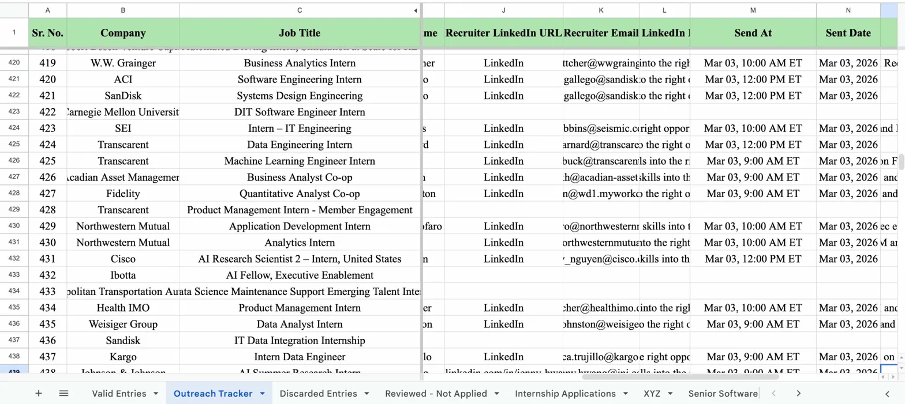
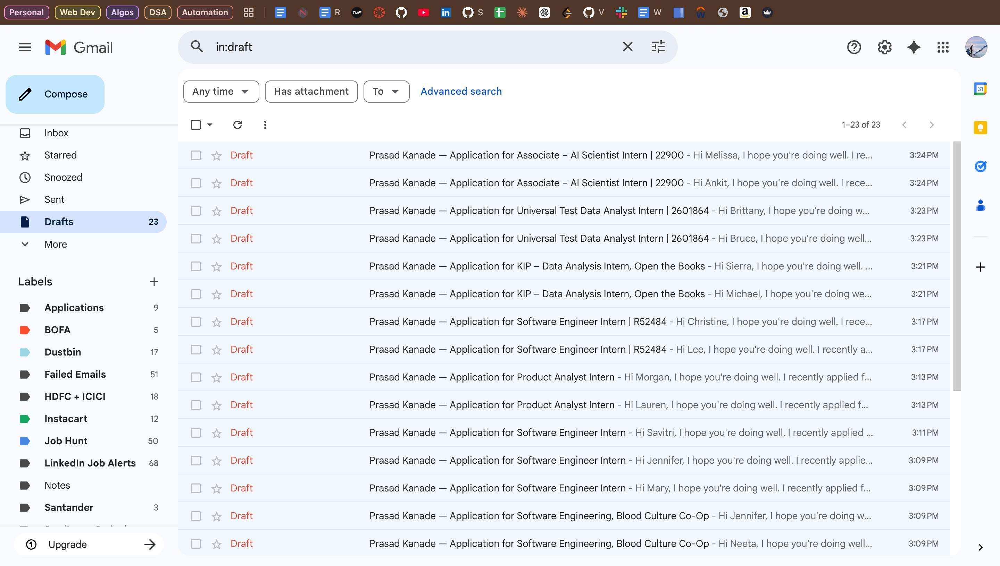

# Automated Job Hunt Pipeline

End-to-end system that aggregates 2,500+ weekly internship postings, validates eligibility, discovers hiring manager emails, and creates personalized outreach drafts — all automatically.

**Built by [Prasad Kanade](https://www.linkedin.com/in/prasadkanade/) | MS Computer Science @ Northeastern University**

## What It Does

Two Python modules work together to automate the entire job search workflow:

**Module 1 — Job Aggregator** scrapes GitHub repositories (SimplifyJobs, vanshb03) and Gmail alerts (Jobright, SWE List, ZipRecruiter, Company Newsletters), validates each job against 25+ eligibility criteria, deduplicates across 1,500+ tracked entries, and maintains an organized Google Sheets tracker.

**Module 2 — Outreach Pipeline** takes validated jobs, mirrors them to an Outreach Tracker sheet in exact order, discovers hiring manager and recruiter email addresses through an 8-layer verification system, creates personalized email drafts in Gmail with resume attachment, schedules timezone-aware delivery, tracks delivery status, auto-retries bounced emails with alternative patterns, and generates LinkedIn connection messages for both HMs and recruiters.

**Impact:** 6 hours/week → 45 minutes/week. Zero duplicate applications. 98%+ classification accuracy. 25+ outreach emails generated per run.

## Screenshots

### Aggregator Terminal Output

Processing jobs from GitHub repos and email sources with real-time validation feedback.



### Aggregator Summary

Breakdown of valid, discarded, and duplicate jobs across all sources.



### Valid Entries Sheet

Validated internship postings with status, company, title, date applied, job URL and other fields.



### Valid Entries Detail

Job metadata including job type, location, remote status, entry timestamp and source.



### Outreach Terminal Output

Email discovery and draft creation with bounce detection and retry logic.


### Outreach Summary

Email extraction stats showing successful extractions, draft creation, and failure counts.


### Outreach Tracker Sheet

Email outreach tracking with HM/recruiter names, LinkedIn URLs, discovered emails, LinkedIn messages, scheduled send times, and delivery notes.



### Outreach Tracker Detail

Recruiter LinkedIn URLs, emails, LinkedIn messages, Send At scheduling, and sent date tracking.



### Gmail Drafts

Personalized email drafts auto-created in Gmail with resume attachment, ready for scheduled sending.



## How It Works

### Job Aggregation Pipeline

```
GitHub Repos + Gmail Alerts
    → Parse 2,000+ weekly postings
    → Resolve redirects (SimplifyJobs, Jobright, ZipRecruiter)
    → Detect INACTIVE Simplify listings (auto-skip)
    → Extract metadata from Simplify pages (location, remote, sponsorship)
    → Fetch career pages (Selenium + BeautifulSoup)
    → Extract metadata (company, location, job ID, type)
    → 25-stage validation (visa, degree, geography, role type, posting age...)
    → Multi-signal deduplication (URL + company|title + job ID)
    → Company name normalization (20+ alias mappings)
    → Google Sheets output
```

The aggregator processes jobs from multiple sources simultaneously. Each job passes through eligibility filters including F-1 visa requirements, explicit foreign national rejection detection, security clearance detection, degree level filtering (BA/BS-only and PhD-only detection), undergraduate-only role detection, geographic restrictions (40+ international countries detected), posting age validation (including ZipRecruiter 3-day freshness check), season verification, expired job detection, and smart deduplication that catches the same job posted across different platforms.

### Email Discovery Pipeline

```
Company + Hiring Manager Name
    │
    ▼
Layer 1: Seed pattern cache (35+ companies, instant)
Layer 2: Microsoft 365 verification (definitive yes/no)
Layer 3: Website pattern mining (scrapes company sites)
Layer 4: Reacher SMTP verification (Docker-based)
Layer 5: Reacher pattern search
Layer 6: API cascade (Hunter)
Layer 7: Microsoft 365 pattern discovery (tries 5 formats)
Layer 8: Statistical inference (80% of companies use first.last)
    │
    ▼
Gmail Draft Created → Delivery Tracking → Bounce Auto-Retry
```

The system learns over time. Every successful email discovery teaches it the pattern for that company's entire domain. Failed patterns are stored and never retried. After two weeks of operation, most companies resolve instantly from cache. Supports multiple comma-separated HM/Recruiter names per row — each person gets an individual email.

### Outreach Lifecycle

```
Job validated → Synced to Outreach Tracker (exact Valid sheet order)
    → Email discovered for HM/Recruiter
    → Personalized Gmail draft created with resume attachment
    → Scheduled for delivery in company's timezone
    → LinkedIn messages generated (separate templates for HM and Recruiter)
    → Email sent at scheduled time
    → [12 hours pass]
    → No bounce detected → Notes: "Delivered to HM and Rec"
    → Bounce detected → Notes: "HM email bounced on Mar 01, 2026"
        → Auto-retry with alternative email pattern
        → Notes updated: "Retried: flast@co.com"
```

## Key Features

### Multi-Source Aggregation

- GitHub repositories (SimplifyJobs, vanshb03) with section category trust
- Gmail API integration (Jobright alerts, SWE List, ZipRecruiter emails)
- Simplify URL resolution (5 methods including Next.js JSON extraction)
- Simplify metadata extraction (location, remote status, sponsorship from page text)
- INACTIVE job detection on Simplify pages
- ZipRecruiter page age validation (rejects postings older than 3 days)
- Selenium fallback for JavaScript-heavy career pages (Workday, Oracle, Ashby)

### 25-Stage Validation

- Company and platform blacklists
- Security clearance and US Person requirements
- Explicit F-1/foreign national visa rejection detection
- Degree level filtering (BA/BS-only and PhD-only roles)
- Undergraduate-only role detection (junior/senior status, pursuing bachelor's)
- Geographic restrictions (40+ international countries in title, location, URL)
- Ambiguous city disambiguation (Burlington MA vs Burlington ON)
- Permanent US work authorization detection
- Graduation year alignment (May 2027)
- Job posting age validation (configurable threshold)
- Smart season detection (ignores copyright years, financial data)
- Non-CS/Engineering role filtering with GitHub category override
- Expired job detection (20+ dead page patterns)
- ATS platform company name extraction (Workday, Greenhouse, Lever, iCIMS, UltiPro, Jobvite)
- Company name normalization with legal suffix stripping and acronym preservation

### Intelligent Deduplication

- URL normalization and matching
- Company + title fuzzy matching
- Job ID cross-reference
- Company name normalization (20+ alias mappings: WD/Sandisk → Western Digital, Boxinc → Box)

### Email Discovery and Verification

- Provider detection: MX record lookup identifies Google Workspace (~40%) vs Microsoft 365 (~35%) vs self-hosted
- Microsoft 365 verification: Definitive email existence check via GetCredentialType endpoint
- Website mining: Scrapes company about/team/contact pages for @domain emails to learn patterns
- Pattern learning: Every successful discovery teaches the pattern for that entire company domain
- Statistical inference: When all else fails, uses the most common pattern (first.last, 80% accuracy)
- Multi-person support: Comma-separated names generate individual emails for each contact
- Anti-bot measures: 2-3 second delays, rotating user agents, catch-all detection

### Delivery Tracking and Bounce Recovery

- Bounce scanner reads Gmail for delivery failure notifications (RFC 3464 DSN parsing)
- Failed emails are cleared and noted in plain language
- Auto-retry generates alternative email patterns, skipping the failed one
- Failed patterns stored permanently to prevent repeating mistakes
- Delivery confirmed after 12 hours with no bounce
- Late bounces overwrite delivery status (bounce is always the truth)

### Dual LinkedIn Message Generation

- Separate templates for Hiring Managers and Recruiters
- HM message emphasizes team contribution and role fit
- Recruiter message emphasizes eagerness and next steps
- Supports multiple comma-separated names per row
- Auto-truncates long titles to stay within LinkedIn's 300-character limit

### Self-Improving System

- Pattern cache grows with every run and learns email formats automatically
- Failed Simplify URLs retried after 8 hours instead of being permanently skipped
- Retry tracker with 3-day TTL prevents infinite loops on undiscoverable companies
- MX cache and email verification cache prevent redundant lookups
- Domain overrides for companies with wrong Clearbit results
- Outreach sheet stays perfectly synchronized with Valid Entries (exact order, verbatim names)
- LinkedIn URL columns are read-only — never overwritten by automation

## Performance

| Metric                  | Before      | After              |
| ----------------------- | ----------- | ------------------ |
| Weekly manual work      | 6 hours     | 45 minutes         |
| Job processing time     | 40 min      | 10 min             |
| Duplicate applications  | 2-5/run     | 0                  |
| Classification accuracy | ~85%        | 98%+               |
| Email extraction rate   | 0% (manual) | ~95% automated     |
| Outreach emails/run     | 0 (manual)  | 25+                |
| LinkedIn messages/run   | 0 (manual)  | 25+ auto-generated |

## Tech Stack

**Core:** Python 3.10+, Google Sheets API, Gmail API

**Web Scraping:** Selenium WebDriver, BeautifulSoup4, Requests, lxml

**Email Discovery:** dnspython (MX records), Reacher (SMTP verification via Docker), Hunter API, Microsoft 365 GetCredentialType

**Infrastructure:** Docker (Reacher container), Google Cloud service accounts, OAuth 2.0

**Codebase:** 12,000+ lines across 14 production modules

## Architecture

```
Job Hunt Tracker/
├── aggregator/                # Module 1: Job aggregation
│   ├── config.py              # Patterns, blacklists, normalizations (1,500+ lines)
│   ├── extractors.py          # Page fetching, Simplify resolution, GitHub scraper
│   ├── processors.py          # Validation, extraction, location processing
│   ├── run_aggregator.py      # Pipeline orchestration
│   ├── sheets_manager.py      # Google Sheets integration
│   └── utils.py               # HTTP retry, sanitization, date parsing
├── outreach/                  # Module 2: Email outreach
│   ├── outreach_config.py     # Column mapping, email templates, API keys
│   ├── outreach_data.py       # Sheets sync, PatternCache, NameParser, bounce handling
│   ├── outreach_finder.py     # 8-layer email discovery pipeline
│   ├── outreach_mailer.py     # Gmail draft creation with resume attachment
│   ├── outreach_provider.py   # MX lookup, Microsoft 365, website mining
│   ├── bounce_scanner.py      # Gmail bounce detection (RFC 3464)
│   └── run_outreach.py        # Pipeline orchestration, delivery tracking
├── scripts/                   # Maintenance utilities
├── .local/                    # Credentials, caches, logs (gitignored)
│   ├── credentials.json       # Google Sheets service account
│   ├── gmail_credentials.json # Gmail OAuth client
│   ├── gmail_token.pickle     # Gmail OAuth token
│   ├── domain_overrides.json  # Manual company-to-domain fixes
│   ├── failed_patterns.json   # Bounced email patterns (never retried)
│   ├── bounced_emails.json    # Known bounced addresses
│   ├── outreach_patterns.json # Learned email patterns per domain
│   ├── retry_tracker.json     # Failed companies (3-day TTL)
│   └── outreach.log           # Rotating log (5MB × 3)
├── docs/screenshots/          # README images
├── docker-compose.yml         # Reacher email verifier
├── requirements.txt
└── README.md
```

## Google Sheets Structure

### Valid Entries

Validated internship postings with status tracking: Sr. No., Status, Company, Title, Date Applied, Job URL, Job ID, Job Type, Location, Resume, Remote?, Entry Date, Source, Sponsorship, and Notes.

### Outreach Tracker

Email outreach tracking synchronized with Valid Entries: Sr. No., Company, Job Title, Job ID, HM Name, HM LinkedIn URL, HM Email, HM LinkedIn Msg, Recruiter Name, Recruiter LinkedIn URL, Recruiter Email, Rec LinkedIn Msg, Send At, Sent Date, and Notes. LinkedIn URL columns are preserved as read-only — automation never overwrites manually entered profile links.

### Discarded Entries

Rejected postings with the specific discard reason (Non-USA location, Non-tech role, Blacklisted company, Undergraduate only, PhD only, Security clearance required, Wrong season, Expired posting, etc.), preserving full metadata for review.

### Outreach Notes Column

The Notes column automatically tracks email delivery status:

| Status              | Example Notes                                            |
| ------------------- | -------------------------------------------------------- |
| Delivered to one    | Delivered to HM                                          |
| Delivered to both   | Delivered to HM and Rec                                  |
| One bounced         | HM email bounced on Mar 01, 2026                         |
| Both bounced        | HM and Rec emails bounced on Mar 01, 2026                |
| Bounced and retried | HM email bounced on Mar 01, 2026 · Retried: flast@co.com |
| Partial delivery    | HM email bounced on Mar 01, 2026 · Delivered to Rec      |

## Results

**Daily aggregation:** Processes 500+ postings, produces ~70 valid, ~50 discarded, and ~200 duplicates caught in 10 minutes.

**Email discovery:** 25+ emails extracted per run across 15 companies. The 8-layer system resolves previously-impossible companies (T-Mobile, Skyryse, Cleveland Clinic).

**Cumulative:** 450+ tracked entries, 100+ outreach emails sent, zero duplicate applications across 7 months of operation.

## Quick Start

### Prerequisites

- Python 3.10+
- Google Sheets API credentials (service account)
- Gmail API credentials (OAuth)
- Docker (optional, for Reacher SMTP verification)
- ChromeDriver (for Selenium-based page fetching)

### Installation

```bash
python3 -m venv venv
source venv/bin/activate
pip install -r requirements-local.txt

# Optional: Reacher for SMTP verification
docker compose up -d
```

### Running

```bash
# Aggregate new jobs
python3 -m aggregator

# Find emails and create outreach drafts
python3 -m outreach

# Move reviewed jobs
python3 scripts/cleanup_not_applied.py
```

### Configuration

1. Place Google Sheets service account JSON in `.local/credentials.json`
2. Place Gmail OAuth client JSON in `.local/gmail_credentials.json`
3. Create `.env` with API keys: `HUNTER_API_KEY`
4. Edit `outreach/outreach_config.py` for sender name and email templates
5. Add domain overrides in `.local/domain_overrides.json` for companies with wrong Clearbit results
6. Place resumes as `.local/Prasad Kanade SWE Resume.pdf` and `.local/Prasad Kanade ML Resume.pdf`

## Contact

**Prasad Chandrashekhar Kanade** · MS Computer Science | Northeastern University | May 2027

[Email](mailto:kanade.pra@northeastern.edu) · [LinkedIn](https://www.linkedin.com/in/prasad-kanade-/) · [GitHub](https://github.com/prasad0411)
