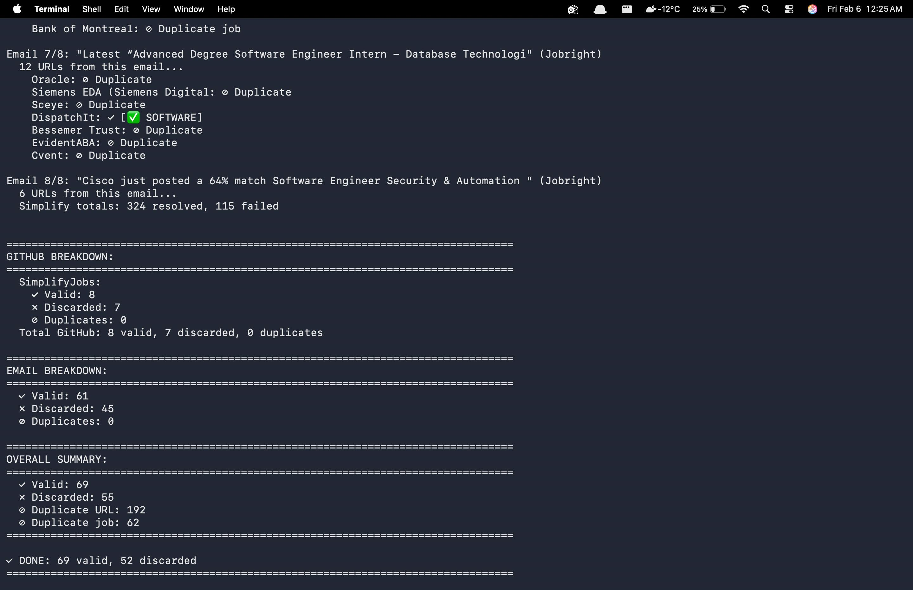
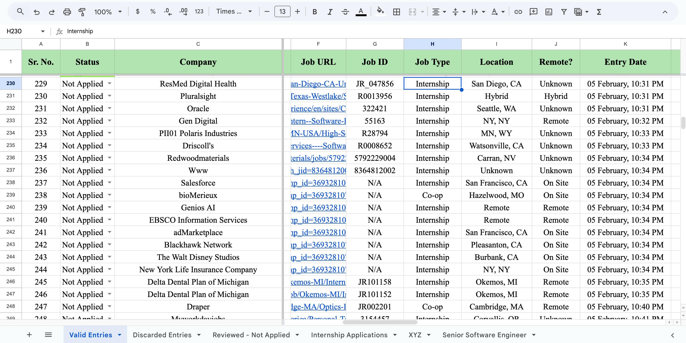
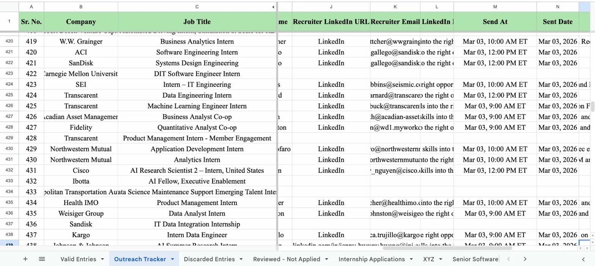
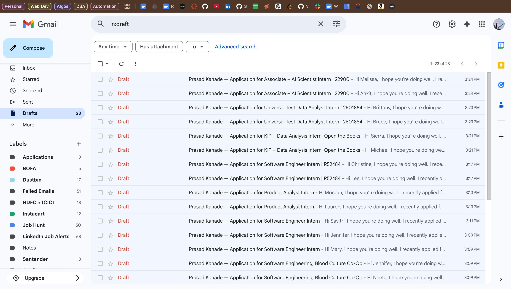

# Automated Job Hunt Pipeline

End-to-end system that aggregates 8,000+ weekly internship postings, validates eligibility, discovers hiring manager emails, and creates personalized outreach drafts — all automatically.

**Built by [Prasad Kanade](https://www.linkedin.com/in/prasad-kanade-/) | MS Computer Science @ Northeastern University**

## What It Does

Two Python modules work together to automate the entire job search workflow:

**Module 1 — Job Aggregator** scrapes GitHub repositories (SimplifyJobs, vanshb03) and Gmail alerts (Jobright, SWE List, ZipRecruiter, Company Newsletters), validates each job against 25+ eligibility criteria, deduplicates across 1,500+ tracked entries, and maintains an organized Google Sheets tracker.

**Module 2 — Outreach Pipeline** takes validated jobs, mirrors them to an Outreach Tracker sheet in exact order, discovers hiring manager and recruiter email addresses through an 8-layer verification system, creates personalized email drafts in Gmail with resume attachment, schedules timezone-aware delivery, tracks delivery status, auto-retries bounced emails with alternative patterns, and generates LinkedIn connection messages for both HMs and recruiters.

**Impact:** 6 hours/week → 45 minutes/week. Zero duplicate applications. 98%+ classification accuracy. 25+ outreach emails generated per run.

## Screenshots

### Aggregator Terminal Output

Processing jobs from GitHub repos and email sources with real-time validation feedback.


### Aggregator Summary

Breakdown of valid, discarded, and duplicate jobs across all sources.


### Valid Entries Sheet

Validated internship postings with status, company, title, date applied, job URL and other fields.


### Valid Entries Detail

Job metadata including job type, location, remote status, entry timestamp and source.


### Outreach Tracker Sheet

Email outreach tracking with HM/recruiter names, LinkedIn URLs, discovered emails, LinkedIn messages, scheduled send times, and delivery notes.


### Outreach Tracker Detail

Recruiter LinkedIn URLs, emails, LinkedIn messages, Send At scheduling, and sent date tracking.


### Gmail Drafts

Personalized email drafts auto-created in Gmail with resume attachment, ready for scheduled sending.


## How It Works

### Job Aggregation Pipeline

```
GitHub Repos + Gmail Alerts
    → Parse 2,000+ weekly postings
    → Resolve redirects (SimplifyJobs, Jobright, ZipRecruiter)
    → Detect INACTIVE Simplify listings (auto-skip)
    → Extract metadata from Simplify pages (location, remote, sponsorship)
    → Fetch career pages (Selenium + BeautifulSoup)
    → Extract metadata (company, location, job ID, type)
    → 25-stage validation (visa, degree, geography, role type, posting age...)
    → Multi-signal deduplication (URL + company|title + job ID)
    → Company name normalization (20+ alias mappings)
    → Google Sheets output
```

The aggregator processes jobs from multiple sources simultaneously. Each job passes through eligibility filters including F-1 visa requirements, explicit foreign national rejection detection, security clearance detection, degree level filtering (BA/BS-only and PhD-only detection), undergraduate-only role detection, junior/senior year standing detection, geographic restrictions (40+ international countries detected), posting age validation (including ZipRecruiter 3-day freshness check with URL expiry pre-validation), season verification, expired job detection, hardware/optics/laser/SkillBridge role filtering, and smart deduplication that catches the same job posted across different platforms.

### Email Discovery Pipeline

```
Company + Hiring Manager Name
    │
    ▼
Layer 1: Seed pattern cache (45+ companies, instant)
Layer 2: DomainHistory confirmed pattern (learned from past deliveries)
Layer 3: Microsoft 365 verification (definitive yes/no)
Layer 4: Website pattern mining (votes across all found emails)
Layer 5: Reacher SMTP verification (Docker-based)
Layer 6: Reacher pattern search
Layer 7: API cascade (Apollo → Hunter → Snov → Prospeo)
Layer 8: Statistical inference (80% of companies use first.last)
    │
    ▼
Pre-send bounce check → Gmail Draft Created → Delivery Tracking → Bounce Auto-Retry
```

The system learns over time. Every successful email discovery teaches it the pattern for that company's entire domain — immediately updating both `DomainHistory` and `PatternCache`. Failed patterns are stored and never retried. Bounced emails invalidate the email verification cache. After two weeks of operation, most companies resolve instantly from cache.

### Outreach Lifecycle

```
Job validated → Synced to Outreach Tracker (exact Valid sheet order)
    → Mark Extract=yes manually for rows to process
    → Email discovered for HM/Recruiter (only Extract=yes rows)
    → Pre-send check: blocked if email in bounce cache or failed patterns
    → Personalized Gmail draft created with resume attachment
    → Scheduled for delivery in company's timezone
    → LinkedIn messages generated (separate templates for HM and Recruiter)
    → Email sent at scheduled time
    → [12 hours pass]
    → No bounce detected → Notes: "Delivered to HM and Rec"
    → Bounce detected → Notes: "HM email bounced on Mar 01, 2026"
        → Auto-retry with alternative email pattern
        → Notes updated: "Retried: flast@co.com"
        → Bounce invalidates email verify cache for that address
```

## Key Features

### Multi-Source Aggregation

- GitHub repositories (SimplifyJobs, vanshb03) with section category trust
- Gmail API integration (Jobright alerts, SWE List, ZipRecruiter emails)
- Simplify URL resolution (5 methods with learned best-method cache per domain)
- Simplify metadata extraction (location, remote status, sponsorship from page text)
- INACTIVE job detection on Simplify pages
- ZipRecruiter URL expiry pre-validation (rejects before fetching if `expires` param is stale)
- ZipRecruiter page age validation (rejects postings older than 3 days)
- Selenium fallback for JavaScript-heavy career pages (Workday, Oracle, Ashby)
- HTTP response cache persisted to disk (6-hour TTL, max 500 entries)

### 25-Stage Validation

- Company and platform blacklists
- Security clearance and US Person requirements
- Explicit F-1/foreign national visa rejection detection
- Citizenship required detection (including combined phrases like "legal right to work without sponsorship")
- Degree level filtering (BA/BS-only and PhD-only roles)
- Undergraduate-only role detection (junior/senior year standing, pursuing bachelor's)
- Hardware/optics/photonics/laser/materials science role filtering
- SkillBridge and DoD military-only internship filtering
- Geographic restrictions (40+ international countries, Canadian province/CAN suffix detection)
- Ambiguous city disambiguation (Burlington MA vs Burlington ON)
- Permanent US work authorization detection
- Graduation year alignment (May 2027)
- Job posting age validation (configurable threshold)
- Smart season detection (ignores copyright years, financial data)
- Non-CS/Engineering role filtering with GitHub category override
- Expired job detection (20+ dead page patterns)
- ATS platform company name extraction (Workday, Greenhouse, Lever, iCIMS, UltiPro, Jobvite)
- Company name normalization with legal suffix stripping, ATS code removal, "The X Companies" → "X"
- Location cleaning: strips compensation text, floor/address details, CAN suffix

### Intelligent Deduplication

- URL normalization and matching
- Company + title fuzzy matching
- Job ID cross-reference
- Company name normalization (20+ alias mappings: WD/Sandisk → Western Digital, Boxinc → Box)

### Email Discovery and Verification

- Provider detection: MX record lookup identifies Google Workspace (~40%) vs Microsoft 365 (~35%) vs self-hosted
- Microsoft 365 verification: Definitive email existence check via GetCredentialType endpoint
- Website mining: Scrapes company about/team/contact pages, votes across all found emails to learn pattern
- Pattern learning: Every successful delivery updates both DomainHistory and PatternCache immediately
- Dual failure tracking: failed_patterns.json + domain_pattern_history.json cross-referenced on every send
- Pre-send blocking: emails checked against bounce cache AND failed patterns before drafting
- Statistical inference: When all else fails, uses the most common pattern (first.last, 80% accuracy)
- Multi-person support: Comma-separated names generate individual emails for each contact
- Anti-bot measures: 2-3 second delays, rotating user agents, catch-all detection
- Apollo, Hunter, Snov, Prospeo API cascade with credit tracking and daily auto-reset

### Delivery Tracking and Bounce Recovery

- Bounce scanner reads Gmail inbox AND "Failed Emails" label for delivery failure notifications
- Bounced emails invalidate stale email_verify_cache.json entries automatically
- Failed emails are cleared and noted in plain language
- Auto-retry generates alternative email patterns, skipping the failed one
- Failed patterns stored as both local parts AND pattern strings for domain-wide blocking
- Delivery confirmed after 12 hours with no bounce
- Late bounces overwrite delivery status (bounce is always the truth)

### Dual LinkedIn Message Generation

- Separate templates for Hiring Managers and Recruiters
- HM message emphasizes team contribution and role fit
- Recruiter message emphasizes eagerness and next steps
- Supports multiple comma-separated names per row
- Auto-truncates long titles to stay within LinkedIn's 300-character limit
- Only generates messages for rows marked Extract=yes (skips Skip rows)

### Self-Improving System

- DomainHistory confirmed patterns consulted before any API call — instant resolution for known domains
- PatternCache updated immediately on every successful delivery
- Website mining votes across all personal emails found (not just first) to determine pattern
- Simplify resolver learns and caches the best resolution method per domain
- ProcessedEmailTracker capped at 10,000 entries with oldest-first pruning
- MX cache and email verification cache prevent redundant lookups
- Domain overrides for companies with wrong Clearbit results
- Outreach sheet stays perfectly synchronized with Valid Entries (exact order, verbatim names)
- LinkedIn URL columns are read-only — never overwritten by automation
- Retry tracker distinguishes permanent failures from transient credit exhaustion
- Bounce invalidates verify cache — system never re-trusts a bounced address

### Automated Scheduling (macOS launchd)

- Aggregator runs at 8 AM, 3 PM, 9 PM daily via launchd
- Cleanup runs every 2 days at 7 AM via launchd
- **Catch-up on wake**: if Mac was asleep at scheduled time, job runs immediately on next wake
- Screen lock (`Cmd+Ctrl+Q`) does not interrupt scheduled jobs
- Resume auto-sync: latest resumes copied from Downloads to `.local/` before every run
- All logs saved to `.local/cron_logs/` with 7-day retention

## Performance

| Metric                  | Before      | After              |
| ----------------------- | ----------- | ------------------ |
| Weekly manual work      | 6 hours     | 45 minutes         |
| Job processing time     | 40 min      | 10 min             |
| Duplicate applications  | 2-5/run     | 0                  |
| Classification accuracy | ~85%        | 98%+               |
| Email extraction rate   | 0% (manual) | ~95% automated     |
| Outreach emails/run     | 0 (manual)  | 25+                |
| LinkedIn messages/run   | 0 (manual)  | 25+ auto-generated |
| Tracked entries         | 0           | 587+               |
| Outreach emails sent    | 0           | 100+               |

## Tech Stack

**Core:** Python 3.12+, Google Sheets API, Gmail API

**Web Scraping:** Selenium WebDriver, BeautifulSoup4, Requests, lxml

**Email Discovery:** dnspython (MX records), Reacher (SMTP verification via Docker), Apollo API, Hunter API, Snov API, Prospeo API, Microsoft 365 GetCredentialType

**Infrastructure:** Docker (Reacher container), macOS launchd (scheduled automation), Google Cloud service accounts, OAuth 2.0

**Codebase:** 11,500+ lines across 14 production modules

## Architecture

```
Job Hunt Tracker/
├── aggregator/                # Module 1: Job aggregation
│   ├── config.py              # Patterns, blacklists, normalizations (2,000+ lines)
│   ├── extractors.py          # Page fetching, Simplify resolution, GitHub scraper
│   ├── processors.py          # Validation, extraction, location processing (3,200+ lines)
│   ├── run_aggregator.py      # Pipeline orchestration
│   ├── sheets_manager.py      # Google Sheets integration
│   └── utils.py               # HTTP retry, sanitization, date parsing
├── outreach/                  # Module 2: Email outreach
│   ├── outreach_config.py     # Column mapping, email templates, API keys
│   ├── outreach_data.py       # Sheets sync, PatternCache, NameParser, bounce handling
│   ├── outreach_finder.py     # 8-layer email discovery pipeline
│   ├── outreach_mailer.py     # Gmail draft creation with resume attachment
│   ├── outreach_provider.py   # MX lookup, Microsoft 365, website mining
│   ├── outreach_verifier.py   # Confidence scoring, CircuitBreaker, DomainHistory
│   ├── bounce_scanner.py      # Gmail bounce detection (RFC 3464 + Failed Emails label)
│   └── run_outreach.py        # Pipeline orchestration, delivery tracking
├── scripts/                   # Automation utilities
│   ├── cron_runner.sh         # launchd aggregator runner (syncs resumes first)
│   ├── cron_cleanup.sh        # launchd cleanup runner (2-day gate)
│   ├── cleanup_not_applied.py # Moves Not Applied + expired jobs to Reviewed sheet
│   ├── resume_sync.sh         # Syncs latest resumes from Downloads to .local/
│   ├── com.prasad.jobtracker.aggregator.plist  # launchd agent: aggregator
│   └── com.prasad.jobtracker.cleanup.plist     # launchd agent: cleanup
├── .local/                    # Credentials, caches, logs (gitignored)
│   ├── credentials.json           # Google Sheets service account
│   ├── gmail_credentials.json     # Gmail OAuth client
│   ├── gmail_token.pickle         # Gmail OAuth token
│   ├── domain_overrides.json      # Manual company-to-domain fixes
│   ├── failed_patterns.json       # Bounced email patterns (never retried)
│   ├── bounced_emails.json        # Known bounced addresses
│   ├── outreach_patterns.json     # Learned email patterns per domain
│   ├── domain_pattern_history.json # Confirmed/failed patterns with staleness tracking
│   ├── email_verify_cache.json    # Provider verification cache (invalidated on bounce)
│   ├── retry_tracker.json         # Failed companies (3-day TTL)
│   ├── simplify_method_cache.json # Best Simplify resolution method per domain
│   ├── http_response_cache.json   # Persisted HTTP cache (6-hour TTL)
│   └── outreach.log               # Rotating log (5MB × 3)
├── docker-compose.yml         # Reacher email verifier
├── requirements.txt
└── README.md
```

## Google Sheets Structure

### Valid Entries

Validated internship postings with status tracking: Sr. No., Status, Company, Title, Date Applied, Job URL, Job ID, Job Type, Location, Resume, Remote?, Entry Date, Source, Sponsorship, and Notes.

### Outreach Tracker

Email outreach tracking synchronized with Valid Entries: Sr. No., Company, Job Title, Extract, Job ID, HM Name, HM LinkedIn URL, HM Email, HM LinkedIn Msg, Recruiter Name, Recruiter LinkedIn URL, Recruiter Email, Rec LinkedIn Msg, Send At, Sent Date, Notes, Confidence.

The **Extract** column controls outreach processing:

- `yes` → pipeline discovers emails, creates drafts, generates LinkedIn messages
- `Skip` → row is ignored entirely by all outreach automation

LinkedIn URL columns are preserved as read-only — automation never overwrites manually entered profile links.

### Discarded Entries

Rejected postings with the specific discard reason (Non-USA location, Non-tech role, Blacklisted company, Undergraduate only, PhD only, Security clearance required, Wrong season, Expired posting, Hardware/laser role, SkillBridge military-only, etc.), preserving full metadata for review.

### Reviewed — Not Applied

Jobs moved from Valid Entries either manually (marked Not Applied) or automatically (blank status, entry date 3+ days old). Reason column tracks why each job was moved.

### Outreach Notes Column

| Status              | Example Notes                                            |
| ------------------- | -------------------------------------------------------- |
| Delivered to one    | Delivered to HM                                          |
| Delivered to both   | Delivered to HM and Rec                                  |
| One bounced         | HM email bounced on Mar 01, 2026                         |
| Both bounced        | HM and Rec emails bounced on Mar 01, 2026                |
| Bounced and retried | HM email bounced on Mar 01, 2026 · Retried: flast@co.com |
| Partial delivery    | HM email bounced on Mar 01, 2026 · Delivered to Rec      |

## Results

**Daily aggregation:** Processes 500+ postings, produces ~70 valid, ~50 discarded, and ~200 duplicates caught in 10 minutes.

**Email discovery:** 25+ emails extracted per run across 15 companies. The 8-layer system resolves previously-impossible companies (T-Mobile, Skyryse, Cleveland Clinic).

**Cumulative:** 587+ tracked entries, 100+ outreach emails sent, zero duplicate applications across 7 months of operation.

## Quick Start

### Prerequisites

- Python 3.12+
- Google Sheets API credentials (service account)
- Gmail API credentials (OAuth)
- Docker (optional, for Reacher SMTP verification)
- ChromeDriver (for Selenium-based page fetching)

### Installation

```bash
python3 -m venv venv
source venv/bin/activate
pip install -r requirements-local.txt

# Optional: Reacher for SMTP verification
docker compose up -d
```

### Running

```bash
# Aggregate new jobs
python3 -m aggregator

# Find emails and create outreach drafts
python3 -m outreach

# Move reviewed/expired jobs
python3 scripts/cleanup_not_applied.py
```

### Automated Scheduling (macOS)

```bash
# Install launchd agents (runs aggregator 3x/day, cleanup every 2 days)
# Automatically catches up missed runs when Mac wakes from sleep
bash scripts/install_launchd.sh

# Check status
launchctl list | grep com.prasad

# View logs
ls -lt .local/cron_logs/
```

### Configuration

1. Place Google Sheets service account JSON in `.local/credentials.json`
2. Place Gmail OAuth client JSON in `.local/gmail_credentials.json`
3. Create `.env` with API keys:
   ```
   HUNTER_API_KEY=your_key
   APOLLO_API_KEY=your_key
   PROSPEO_API_KEY=your_key
   SNOV_API_KEY=your_key
   SNOV_USER_ID=your_id
   ```
4. Edit `outreach/outreach_config.py` for sender name and email templates
5. Add domain overrides in `.local/domain_overrides.json` for companies with wrong Clearbit results
6. Place resumes in Downloads folder (auto-synced to `.local/` before each run):
   - `Prasad Kanade SWE Resume.pdf`
   - `Prasad Kanade ML Resume.pdf`
   - `Prasad Kanade Data Resume.pdf`

### Outreach Workflow

1. Run aggregator — new jobs appear in Valid Entries
2. Open Outreach Tracker — new rows auto-synced
3. Manually add HM/Recruiter names and LinkedIn URLs for companies you want to target
4. Set `Extract` column to `yes` for those rows
5. Run outreach — emails discovered, drafts created, LinkedIn messages generated
6. Review drafts in Gmail — send manually or let the email sender script run

## Contact

**Prasad Chandrashekhar Kanade** · MS Computer Science | Northeastern University | May 2027

[Email](mailto:kanade.pra@northeastern.edu) · [LinkedIn](https://www.linkedin.com/in/prasad-kanade-/) · [GitHub](https://github.com/prasad0411)
