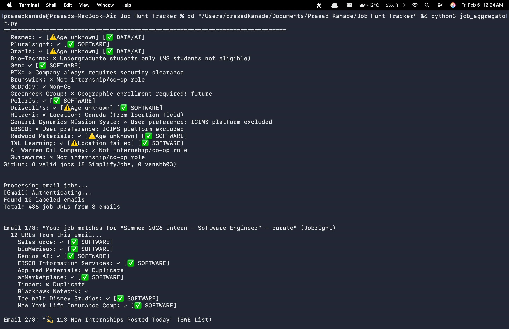
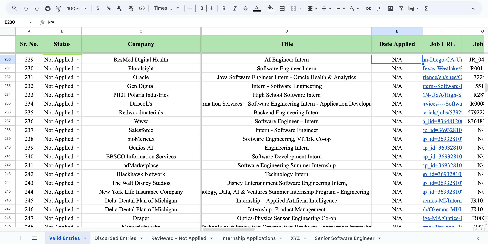
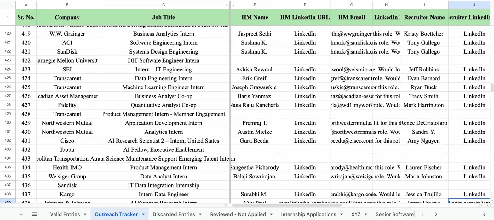
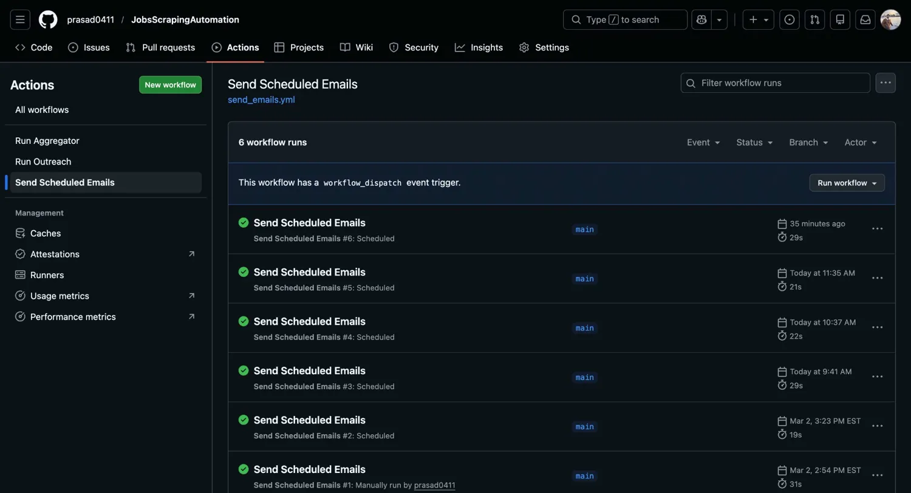

# Automated Job Hunt Pipeline

End-to-end system that aggregates 8,000+ weekly internship postings, validates eligibility, discovers hiring manager emails, and sends personalized outreach — fully automated from your Northeastern University email.

**Built by [Prasad Kanade](https://www.linkedin.com/in/prasad-kanade-/) | MS Computer Science @ Northeastern University**

---

## What It Does

**Module 1 — Job Aggregator** scrapes GitHub repos and Gmail alerts, validates each posting against 25+ eligibility criteria, deduplicates across 1,500+ tracked entries, and writes to Google Sheets.

**Module 2 — Outreach Pipeline** discovers hiring manager emails via an 8-layer verification system, sends personalized emails with the right resume from `kanade.pra@northeastern.edu` via Microsoft Graph API, schedules timezone-aware delivery at 9:30 AM local time, and auto-retries bounces.

**Impact:** 6 hours/week → 15 minutes/week. Zero duplicate applications. 98%+ classification accuracy.

---

## Screenshots

| Aggregator Output | Valid Entries Sheet |
|---|---|
|  |  |

| Outreach Tracker | Nightly Digest |
|---|---|
|  |  |

---

## How It Works

### Aggregation Pipeline

```
GitHub Repos + Gmail Alerts
  → Resolve redirects (Simplify, Jobright, ZipRecruiter)
  → Fetch career pages (Selenium + BeautifulSoup)
  → 25-stage validation (visa, degree, geography, role, salary, age...)
  → Dedup (URL + company|title + job ID)
  → Company name normalization + auto-learning (brain.json)
  → Google Sheets output + SQLite run history
```

### Email Discovery Pipeline

```
Company + HM Name
  → Layer 1: Seed pattern cache (125+ companies, instant)
  → Layer 2: DomainHistory (proven patterns from past deliveries)
  → Layer 3: Microsoft 365 verification (definitive yes/no)
  → Layer 4: Website pattern mining
  → Layer 5-6: Reacher SMTP verification
  → Layer 7: API cascade (Apollo → Hunter → Snov → Prospeo)
  → Layer 8: Statistical inference (first.last)
  → Pre-send bounce check → MS Graph send → Bounce auto-retry
```

### Timezone-Aware Sending

```
Outreach midnight → discovers emails → schedules Send At = next business day 9:30 AM local
  9:00 AM ET  → Eastern companies
  10:30 AM ET → Central companies
  11:30 AM ET → Mountain companies
  12:30 PM ET → Pacific companies
```

---

## Key Features

### Aggregation
- Sources: SimplifyJobs + vanshb03 GitHub repos, Jobright, SWE List, ZipRecruiter, company newsletters
- Simplify metadata extraction: location, remote status, `no_h1b` flag (immediate reject)
- Selenium fallback for JS-heavy pages (Workday, Oracle, Ashby)
- HTTP response cache (6-hour TTL, 500 entries max)

### 25-Stage Validation
- Security clearance, ITAR, US Person, citizenship requirements
- Visa rejection ("unable to sponsor" in all variants)
- Degree filtering: undergrad-only, PhD-only, associate's degree
- Role filtering: hardware, optics, RF, robotics, military, non-CS
- Salary filter: rejects if listed and under $25/hr
- Geographic filter: 40+ countries, Canadian provinces
- Posting age: 3-day default threshold
- Season detection (ignores copyright years, rejects wrong semester)
- Auto-learning company names: URL domain → company saved to brain.json

### Outreach
- 8-layer email discovery with confidence scoring
- DomainHistory: instant resolution for known domains, zero API calls
- PatternCache: learns from every successful delivery
- Auto-Extract: sets Extract=yes for tech hub locations, sponsorship=Yes, PatternCache hits
- Bounce recovery: uses DomainHistory to generate domain-informed retry patterns
- Dead letter queue: after 3 failed attempts, marks row permanently

### Scheduling (Permanent Daemon)
- **Single Python scheduler daemon** with `KeepAlive=true` — replaces 10 launchd plists
- No exit 78, no scheduling bugs, auto-restarts if crashed
- Catches missed jobs on Mac wake/restart
- Waits for network before each job (handles post-sleep delays)

| Job | Schedule |
|---|---|
| Aggregator | 8 AM, 3 PM, 9 PM |
| Send Scheduled | 9 AM, 10:30, 11:30, 12:30 |
| Outreach | Midnight |
| Nightly Digest | 12:22 AM |
| Cleanup | 7 AM |
| Auto-Blacklist | 12:30 AM |
| Retry Simplify | 6 AM |
| Process Bounces | Every 30 min |
| Watchdog | Every 30 min |

### Self-Healing & Intelligence
- **Scheduler daemon**: single KeepAlive process, launchd auto-restarts on crash
- **MS token**: silent refresh on every init, Gmail alert if refresh token expires
- **ChromeDriver**: `webdriver_manager` auto-updates on macOS updates
- **Sheets quota**: exponential backoff retry (5s → 10s → 20s → 40s → 80s)
- **GitHub sources**: graceful fallback if repos unreachable
- **Log rotation**: 500-line cap, 7-day cron log retention, daily .pyc cleanup
- **Auto-blacklist**: weekly build from Discarded Entries (3+ same-reason rejections)
- **Nightly digest**: email summary with stats, circuit breaker status, error lines

---

## Performance

| Metric | Value |
|---|---|
| Weekly manual work | 15 min (was 6 hours) |
| Job processing time | ~2 min/run |
| Classification accuracy | 98%+ |
| Tracked entries | 877+ |
| Outreach emails sent | 130+ |
| Email extraction rate | ~95% automated |
| Duplicate applications | 0 |

---

## Tech Stack

- **Core:** Python 3.14, Google Sheets API, Gmail API, Microsoft Graph API
- **Scraping:** Selenium, BeautifulSoup4, Requests, webdriver-manager
- **Email:** dnspython, Reacher (Docker SMTP), Apollo, Hunter, Snov, Prospeo, MSAL
- **Infrastructure:** Single Python daemon (KeepAlive), SQLite, Docker
- **Intelligence:** brain.json learning system, PatternCache, DomainHistory
- **Codebase:** 15,000+ lines across 18 production modules

---

## Architecture

```
Job Hunt Tracker/
├── aggregator/
│   ├── config.py          # Patterns, blacklists, normalizations (2,500+ lines)
│   ├── extractors.py      # Page fetching, Simplify resolution, GitHub scraper
│   ├── processors.py      # Validation, extraction, location (3,500+ lines)
│   ├── run_aggregator.py  # Pipeline orchestration
│   ├── sheets_manager.py  # Google Sheets (with quota retry)
│   └── utils.py           # HTTP retry, sanitization
├── outreach/
│   ├── outreach_config.py    # Column mapping, templates, API keys
│   ├── outreach_data.py      # Sheets sync, PatternCache, bounce handling
│   ├── outreach_finder.py    # 8-layer email discovery
│   ├── outreach_mailer.py    # MS Graph sending + token self-refresh
│   ├── outreach_provider.py  # MX lookup, M365 verification, web mining
│   ├── outreach_verifier.py  # Confidence scoring, CircuitBreaker
│   ├── bounce_scanner.py     # Gmail bounce detection
│   └── run_outreach.py       # Pipeline orchestration
├── scripts/
│   ├── scheduler.py           # KeepAlive daemon (replaces all launchd plists)
│   ├── cron_runner.sh         # Job runner (resume sync, module exec)
│   ├── send_scheduled.py      # Timezone-aware email sender (4×/day)
│   ├── nightly_digest.py      # Nightly summary email
│   ├── auto_extract.py        # Auto-sets Extract=yes
│   ├── build_auto_blacklist.py
│   ├── cleanup_not_applied.py # Moves stale jobs + log rotation
│   ├── process_bounces.py
│   ├── retry_simplify.py
│   └── watchdog.sh            # Health monitor
└── .local/                    # Credentials, caches, logs (gitignored)
    ├── brain.json             # Learned: domains, companies, patterns, HQ
    ├── scheduler_state.json   # Last run times for all jobs
    ├── run_history.db         # SQLite: per-run stats
    └── cron_logs/             # 7-day rotating job logs
```

---

## Quick Start

### Prerequisites
- Python 3.12+, Docker, ChromeDriver
- Google Sheets service account, Gmail OAuth, Northeastern Microsoft account

### Setup

```bash
python3 -m venv venv && source venv/bin/activate
pip install -r requirements.txt
docker compose up -d  # Reacher SMTP verifier

# One-time MS Graph auth
python3 scripts/test_ms_auth.py

# Place resumes in Downloads (auto-synced before each run):
# "Prasad Kanade SWE Resume.pdf"
# "Prasad Kanade ML Resume.pdf"
# "Prasad Kanade Data Resume.pdf"
```

### Environment

```bash
# .env
HUNTER_API_KEY=
APOLLO_API_KEY=
PROSPEO_API_KEY=
SNOV_API_KEY=
SNOV_USER_ID=
ANTHROPIC_API_KEY=   # optional
SLACK_WEBHOOK_URL=   # optional
```

### Start Scheduler

```bash
launchctl load ~/Library/LaunchAgents/com.prasad.jobtracker.scheduler.plist
launchctl print gui/$(id -u)/com.prasad.jobtracker.scheduler | grep state
tail -f .local/scheduler.log
```

### Manual Runs

```bash
python3 -m aggregator          # Aggregate new jobs
python3 -m outreach            # Find emails + send outreach
python3 scripts/auto_extract.py
python3 scripts/cleanup_not_applied.py
```

### Check Run History

```bash
python3 -c "
import sqlite3
for r in sqlite3.connect('.local/run_history.db').execute(
    'SELECT ts,valid,discarded,failed_http FROM runs ORDER BY ts DESC LIMIT 10'):
    print(r)
"
```

---

## Contact

**Prasad Chandrashekhar Kanade** · MS CS @ Northeastern University · May 2027

[Email](mailto:kanade.pra@northeastern.edu) · [LinkedIn](https://www.linkedin.com/in/prasad-kanade-/) · [GitHub](https://github.com/prasad0411)
