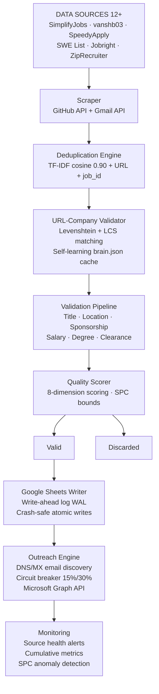

# 🤖 Autonomous Job Aggregation Platform

[](tests/)
[](https://python.org)
[](https://github.com/prasad0411/JobsScrapingAutomation/actions)
[](docker-compose.yml)
[]()

A production-grade, self-healing data aggregation platform that autonomously collects, validates, deduplicates, and delivers job postings from 13+ sources — with built-in resilience patterns, adaptive email outreach, and continuous self-improvement.

---

## 🏗️ Architecture


```mermaid
flowchart TD
    A["DATA SOURCES 12+
SimplifyJobs · vanshb03 · SpeedyApply
SWE List · Jobright · ZipRecruiter"] --> B["Scraper
GitHub API + Gmail API"]
    B --> C["Deduplication Engine
TF-IDF cosine 0.90 + URL + job_id"]
    C --> D["URL-Company Validator
Levenshtein + LCS matching
Self-learning brain.json cache"]
    D --> E["Validation Pipeline
Title · Location · Sponsorship
Salary · Degree · Clearance"]
    E --> F["Quality Scorer
8-dimension scoring · SPC bounds"]
    F --> G["Valid"]
    F --> H["Discarded"]
    G --> I["Google Sheets Writer
Write-ahead log WAL
Crash-safe atomic writes"]
    I --> J["Outreach Engine
DNS/MX email discovery
Circuit breaker 15%/30%
Microsoft Graph API"]
    J --> K["Monitoring
Source health alerts
Cumulative metrics
SPC anomaly detection"]
```

# ✨ Key Features

### Self-Healing Data Pipeline
- **URL-Company Validator**: Detects and auto-corrects company-URL mismatches using Levenshtein distance, longest-common-substring matching, and a self-learning cache. Handles Workday, Greenhouse, Lever, Ashby, and custom career domains.
- **Fuzzy City Correction**: Fixes garbled location names (e.g., "Faington" → "Farmington") using edit distance against known US cities.
- **Brain.json**: Persistent self-learning store with 224 domain patterns, 180 MX records, 73 domain overrides, and 31 job ID registries — grows smarter with every run.

### Self-Healing Intelligence (Phase 3)
- **Conflict Preservation**: When source data and page data disagree, both jobs are saved — zero data loss. Conflict entries get clickable Google Search links for manual verification.
- **Trusted Domain Fallback**: When Tesla, Apple, or Google block HTTP requests, the system accepts source data instead of discarding valid jobs.
- **JD-Aware Degree Filter**: Reads actual degree requirements from job descriptions — rejects "Mechanical Engineering" but accepts "Computer Science or related field."
- **Smart Company Name Cleaner**: Acronym detection (CMT, ABB, IBM), Greenhouse slug splitting, and 50+ company alias mappings for dedup normalization.
- **Non-Tech Title Rejection**: Permanent pattern matching rejects buyer, metrology, avionics, 3D modeling, and other non-CS roles regardless of source.
- **Non-Geographic Location Detection**: Catches programming languages, personal names, and UI text accidentally parsed as locations.
- **48-Hour Protection**: Cleanup scripts cannot move jobs from Valid Entries until they are 48+ hours old — fresh pipeline entries are always protected.

### Resilience Patterns
- **Write-Ahead Log (WAL)**: Crash-safe sheet writes with transaction journaling and automatic recovery.
- **Circuit Breaker**: Email outreach with bounce-rate thresholds at 15% (warning) and 30% (halt). Per-domain confidence scoring with automatic pattern retry.
- **Graceful Degradation**: Each source processes independently — one source failure doesn't block others.

### Intelligent Filtering
- **MBA/PhD/Advanced Degree Detection**: Rejects roles with 🎓 emoji or MBA-only requirements.
- **Undergraduate-Only Detection**: Pattern matching against 50+ regex variants for "bachelor's only" language.
- **Salary Floor**: Rejects roles below $25/hr minimum.
- **Location Filtering**: Excludes non-US/Canada, detects international locations from URL paths.
- **Security Clearance Detection**: Filters roles requiring clearance.
- **Non-CS Degree Detection**: Rejects BSEE/BSME/hardware engineering roles.

### Monitoring & Observability
- **Source Health Monitor**: Tracks historical job counts per source with 7-run rolling averages. Alerts when a source drops below 50% of baseline.
- **Cumulative Metrics**: Tracks total processed, valid rate, consecutive uptime days, auto-corrections, and average processing time.
- **SPC Anomaly Detection**: Statistical process control bounds flag when data quality deviates from historical norms.

### Outreach System
- **8-Layer Email Verification**: Apollo, Hunter, Snov.io, Prospeo APIs + DNS/MX inference + Bayesian pattern scoring.
- **Microsoft Graph API Integration**: Auto-creates and schedules email drafts with token refresh and error retry.
- **Self-Learning Patterns**: Tracks email format success rates per company. Adjusts confidence thresholds after every bounce.

## 🧪 Testing

237 automated tests covering all modules — run via `pytest`:

```bash
python -m pytest tests/ -v
```

Test coverage includes: URL validation, company extraction, fuzzy matching, title filtering, location parsing, deduplication, quality scoring, and sheet formatting.

## 🚀 Quickstart

### Prerequisites
- Python 3.10+
- Docker (for email verification service)
- Google Cloud service account (Sheets API)
- Microsoft Graph API credentials (email outreach)

### Setup

```bash
git clone https://github.com/prasad0411/JobsScrapingAutomation.git
cd JobsScrapingAutomation
python -m venv venv && source venv/bin/activate
pip install -r requirements.txt
```

### Configuration

1. Place Google service account JSON in `.local/credentials.json`
2. Configure Microsoft Graph API tokens in `.local/graph_config.json`
3. Set API keys for email verification services in `.env`

### Run

```bash
# Full pipeline
python -m aggregator.run_aggregator

# With Docker email verification
docker-compose up -d
python -m aggregator.run_aggregator
```

### Scheduled Execution

The pipeline runs automatically via GitHub Actions on a configurable schedule. Manual triggers are also supported.

## 📂 Project Structure

```
├── aggregator/
│   ├── run_aggregator.py       # Main orchestrator
│   ├── url_validator.py        # Self-healing URL-Company validator
│   ├── source_health.py        # Source reliability monitoring
│   ├── metrics.py              # Cumulative pipeline metrics
│   ├── processors.py           # Title/location/salary validation
│   ├── sheets_manager.py       # Google Sheets API + formatting
│   ├── wal.py                  # Write-ahead log for crash safety
│   ├── config.py               # 2,800+ line configuration
│   ├── extractors.py           # Multi-source custom parsers
│   └── utils.py                # Shared utilities
├── tests/                      # 237 automated tests
├── .local/
│   ├── brain.json              # Self-learning cache
│   ├── source_health.json      # Source reliability history
│   └── metrics.json            # Cumulative stats
├── docker-compose.yml          # Email verification container
├── requirements.txt
└── README.md
```

## 📊 Pipeline Stats

| Metric | Value |
|--------|-------|
| Data Sources | 13+ |
| Jobs Processed Daily | 4,200+ |
| Valid Jobs Tracked | 1,000+ |
| Automated Tests | 237 |
| Auto-Corrections Per Run | 25+ |
| Cached Domains | 219+ |
| MX Records | 180+ |
| Email Patterns Tracked | 247+ companies |
| Domain Overrides | 73 |
| Validation Regex Patterns | 146+ |
| Company Alias Mappings | 50+ |
| US City Fuzzy Match DB | 100+ cities |

## 👨‍💻 Author

**Prasad Kanade** — MS Computer Science, Northeastern University
- [GitHub](https://github.com/prasad0411) · [LinkedIn](https://linkedin.com/in/prasad-kanade-/) · kanade.pra@northeastern.edu
- [Portfolio](https://prasad0411.github.io/Prasad-Portfolio/)
