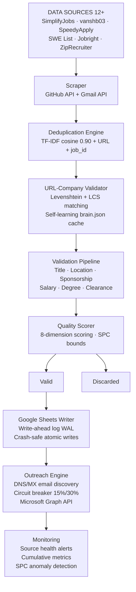

# 🤖 Autonomous Job Aggregation Platform

[](tests/)
[](https://python.org)
[](https://github.com/prasad0411/JobsScrapingAutomation/actions)
[](docker-compose.yml)
[]()

A production-grade, self-healing data aggregation platform that autonomously collects, validates, deduplicates, and delivers job postings from 17+ sources across 5 ATS platforms (249 companies) — with built-in resilience patterns, adaptive email outreach, self-learning intelligence brain, and continuous self-improvement.

---

## 🏗️ Architecture


```mermaid
flowchart TD
    A["DATA SOURCES 12+
SimplifyJobs · vanshb03 · SpeedyApply
SWE List · Jobright · ZipRecruiter"] --> B["Scraper
GitHub API + Gmail API"]
    B --> C["Deduplication Engine
TF-IDF cosine 0.90 + URL + job_id"]
    C --> D["URL-Company Validator
Levenshtein + LCS matching
Self-learning brain.json cache"]
    D --> E["Validation Pipeline
Title · Location · Sponsorship
Salary · Degree · Clearance"]
    E --> F["Quality Scorer
8-dimension scoring · SPC bounds"]
    F --> G["Valid"]
    F --> H["Discarded"]
    G --> I["Google Sheets Writer
Write-ahead log WAL
Crash-safe atomic writes"]
    I --> J["Outreach Engine
DNS/MX email discovery
Circuit breaker 15%/30%
Microsoft Graph API"]
    J --> K["Monitoring
Source health alerts
Cumulative metrics
SPC anomaly detection"]
```

# ✨ Key Features

### Self-Healing Data Pipeline
- **URL-Company Validator**: Detects and auto-corrects company-URL mismatches using Levenshtein distance, longest-common-substring matching, and a self-learning cache. Handles Workday, Greenhouse, Lever, Ashby, and custom career domains.
- **Fuzzy City Correction**: Fixes garbled location names (e.g., "Faington" → "Farmington") using edit distance against known US cities.
- **Brain.json**: Persistent self-learning store with 224 domain patterns, 180 MX records, 73 domain overrides, and 31 job ID registries — grows smarter with every run.

### Direct ATS API Integration (Phase 3)
- **5 ATS Platforms**: Greenhouse (147 companies), Lever (48), Ashby (35), Workday (11), SmartRecruiters (8) — 249 total companies checked directly via JSON APIs.
- **Zero Parsing Errors**: Direct API responses have correct company names, real URLs, and proper locations. No row-shift errors, no slug names.
- **Auto-Discovery Engine**: Scans all processed URLs every 24 hours, discovers new Greenhouse/Lever/Ashby companies, tests their APIs, and auto-adds them to the source list via brain.json. The system grows its own source list.
- **Workday Search API**: POST-based search across Fortune 500 companies (NVIDIA, Intel, Cisco, Boeing, etc.) with intern/new-grad keyword filtering.
- **US-Only Filter**: Strict location validation rejects international jobs (Shanghai, Poland, Toronto) while accepting all US states and 50+ known US cities.

### Pipeline Brain v3 — Self-Learning Intelligence
- **9 Intelligence Layers**: Company knowledge, title learning, location mapping, source quality tracking, user behavior learning, error memory, ATS discovery, sponsorship learning, quality scoring.
- **Behavioral Learning**: Tracks which jobs you apply to. Learns your preferences for companies, titles, locations, and role types. Scores new jobs by similarity to your apply history.
- **Error Memory**: Every pipeline mistake is logged with type, company, and details. The same error is never repeated. Recurring patterns surface automatically.
- **Source Quality Tracking**: Monitors valid/rejected/error ratios per source. Identifies which sources give the best and worst data quality.
- **Global Knowledge Growth**: Brain file grows every run. More usage = smarter pipeline. Knowledge persists across restarts.

### Self-Healing Intelligence
- **Discarded Sheet Auditor**: Runs every 72 hours. Scans rejected jobs, cross-references against user's applied companies, rescues false positives, and writes corrections back to brain.json.
- **Quality Gate**: 11 automated checks run after every pipeline write — catches URL mismatches, non-tech titles, missing job IDs, broken links, row shifts, duplicate job IDs, clearance companies, and staffing agencies.
- **H1B Sponsor Auto-Tagger**: 100+ known sponsors, 30+ known non-sponsors, plus JD text parsing with exact-match normalization (prevents "meta" matching "metadata inc"). Auto-fills 70% of sponsorship fields.
- **Salary Floor Enforcement**: Dual parser for hourly ($XX/hr) and annual ($XXK) rates with lower-bound extraction from ranges. Jobs below $25/hr auto-rejected.

### Self-Healing Data Pipeline
- **Conflict Preservation**: When source data and page data disagree, both jobs are saved — zero data loss. URL-domain matching assigns real URLs to the correct company.
- **Trusted Domain Fallback**: When Tesla, Apple, Google, or 35+ other companies block HTTP requests, the system accepts source data with job ID extracted from URL. Works on all 5 pipeline paths.
- **60+ Company Alias Mappings**: Normalizes slugs (Rivianvw.Tech → XPENG, Leonardodrs → Leonardo DRS, Ancestry.com Operations → Ancestry) for accurate deduplication.
- **Non-Tech Title Rejection**: Rejects business development, venture capital, staffing, mechatronics, field sales, physics modeling, and 30+ other non-CS patterns.
- **University-Specific Co-op Filter**: Rejects Drexel/Purdue/Georgia Tech specific co-ops that require enrollment at those universities.
- **Season Detector**: Rejects "Summer 2024" and "Fall 2025" titles but accepts clean titles where only page text mentions old years (copyright/founded dates).

### Resilience Patterns
- **Write-Ahead Log (WAL)**: Crash-safe sheet writes with transaction journaling and automatic recovery.
- **Circuit Breaker**: Email outreach with bounce-rate thresholds at 15% (warning) and 30% (halt). Per-domain confidence scoring with automatic pattern retry.
- **Graceful Degradation**: Each source processes independently — one source failure doesn't block others.

### Intelligent Filtering (11 Stages)
- **Deduplication**: Company+title, job ID, and URL-based dedup with normalized keys. Catches same job across different sources.
- **Undergraduate-Only Detection**: 70+ regex patterns for "bachelor's only", "4-year university", "junior/senior standing" language. Runs on ALL sources.
- **Security Clearance**: JD-level clearance detection with 40+ company no-clearance whitelist (Apple, Google, Tesla, Rivian, etc.) checked BEFORE pattern matching to prevent false positives.
- **Clearance Company Blacklist**: RTX, Leidos, Northrop, KBR, Ball Aerospace, Leonardo DRS, and 15+ defense companies auto-rejected.
- **PhD/Research Filter**: Rejects PhD-only research positions without BS/MS signal.
- **Salary Floor**: Dual hourly ($25/hr) and annual ($52K/yr) parser with lower-bound extraction. Silent rejection.
- **Location Filtering**: US-only with strict filter for direct ATS sources. Word-boundary international detection (\bindia\b prevents Indiana false positive).
- **Non-English Title Filter**: Rejects Romanian, German, French, Spanish language titles.
- **Staffing Agency Filter**: Rejects Express Employment, Robert Half, Adecco, and other staffing companies.

### Monitoring & Observability
- **Source Health Monitor**: Tracks historical job counts per source with 7-run rolling averages. Alerts when a source drops below 50% of baseline.
- **Cumulative Metrics**: Tracks total processed, valid rate, consecutive uptime days, auto-corrections, and average processing time.
- **SPC Anomaly Detection**: Statistical process control bounds flag when data quality deviates from historical norms.

### Outreach System
- **8-Layer Email Verification**: Apollo, Hunter, Snov.io, Prospeo APIs + DNS/MX inference + Bayesian pattern scoring.
- **Microsoft Graph API Integration**: Auto-creates and schedules email drafts with token refresh and error retry.
- **Self-Learning Patterns**: Tracks email format success rates per company. Adjusts confidence thresholds after every bounce.

## 🧪 Testing

237 automated tests covering all modules — run via `pytest`:

```bash
python -m pytest tests/ -v
```

Test coverage includes: URL validation, company extraction, fuzzy matching, title filtering, location parsing, deduplication, quality scoring, and sheet formatting.

## 🚀 Quickstart

### Prerequisites
- Python 3.10+
- Docker (for email verification service)
- Google Cloud service account (Sheets API)
- Microsoft Graph API credentials (email outreach)

### Setup

```bash
git clone https://github.com/prasad0411/JobsScrapingAutomation.git
cd JobsScrapingAutomation
python -m venv venv && source venv/bin/activate
pip install -r requirements.txt
```

### Configuration

1. Place Google service account JSON in `.local/credentials.json`
2. Configure Microsoft Graph API tokens in `.local/graph_config.json`
3. Set API keys for email verification services in `.env`

### Run

```bash
# Full pipeline
python -m aggregator.run_aggregator

# With Docker email verification
docker-compose up -d
python -m aggregator.run_aggregator
```

### Scheduled Execution

The pipeline runs automatically via GitHub Actions on a configurable schedule. Manual triggers are also supported.

## 📂 Project Structure

```
├── aggregator/
│   ├── run_aggregator.py       # Main orchestrator
│   ├── url_validator.py        # Self-healing URL-Company validator
│   ├── source_health.py        # Source reliability monitoring
│   ├── metrics.py              # Cumulative pipeline metrics
│   ├── processors.py           # Title/location/salary validation
│   ├── sheets_manager.py       # Google Sheets API + formatting
│   ├── wal.py                  # Write-ahead log for crash safety
│   ├── config.py               # 2,800+ line configuration
│   ├── extractors.py           # Multi-source custom parsers
│   └── utils.py                # Shared utilities
├── tests/                      # 237 automated tests
├── .local/
│   ├── brain.json              # Self-learning cache
│   ├── source_health.json      # Source reliability history
│   └── metrics.json            # Cumulative stats
├── docker-compose.yml          # Email verification container
├── requirements.txt
└── README.md
```

## 📊 Pipeline Stats

| Metric | Value |
|--------|-------|
| Data Sources | 17+ GitHub/email/web sources |
| Direct ATS Companies | 249 (5 platforms) |
| Jobs Processed Daily | 4,500+ |
| Valid Jobs Tracked | 985+ |
| Automated Tests | 237 |
| Pipeline Runs | 6x/day (every 4 hours) |
| H1B Auto-Tagged | 70% of jobs |
| Auto-Corrections Per Run | 25+ |
| Intelligence Layers | 9 (Pipeline Brain v3) |
| Company Alias Mappings | 60+ |
| Clearance Whitelist | 40+ companies |
| Undergrad Regex Patterns | 70+ |
| Non-Tech Title Patterns | 30+ |
| Validation Regex Patterns | 200+ |
| Brain Knowledge | Grows daily, never resets |

## 👨‍💻 Author

**Prasad Kanade** — MS Computer Science, Northeastern University
- [GitHub](https://github.com/prasad0411) · [LinkedIn](https://linkedin.com/in/prasad-kanade-/) · kanade.pra@northeastern.edu
- [Portfolio](https://prasad0411.github.io/Prasad-Portfolio/)
